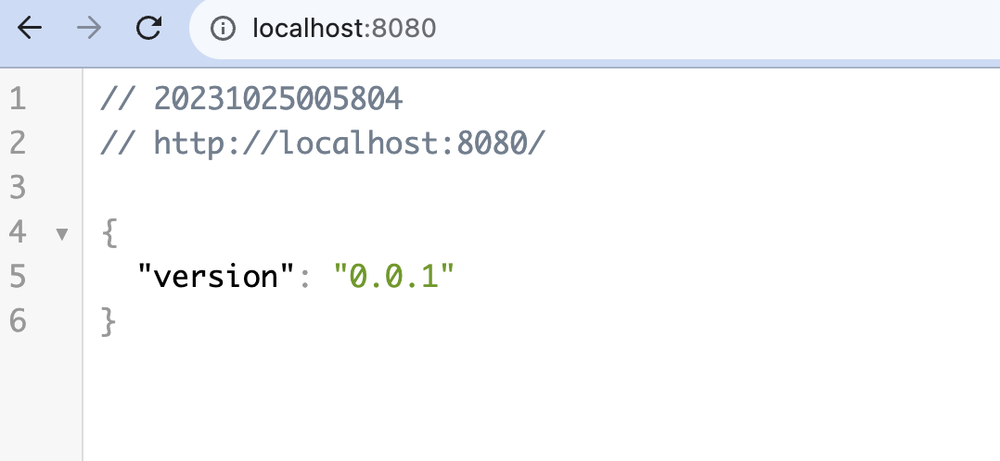

# slim-vending-machine-api

# Instrucciones para Arrancar la Aplicación

Siga estos pasos para arrancar la aplicación utilizando Docker y `docker-compose`. Asegúrese de tener Docker y Docker Compose instalados en su sistema antes de continuar.

## Paso 1: Arrancar los Contenedores

Ejecute el siguiente comando para iniciar los contenedores en segundo plano:

```bash
docker-compose up -d
```

## Paso 2: Migrar la Base de Datos

Para migrar la base de datos y aplicar las migraciones, ejecute el siguiente comando:

```bash
docker-compose exec machine_api composer migrate
```

## Paso 3: Sembrar Datos

ejecutar el siguiente comando para sembrar los valores iniciales:

```bash
docker-compose exec machine_api composer seed
```

## Paso 4: Abrir -> http://localhost:8080/


